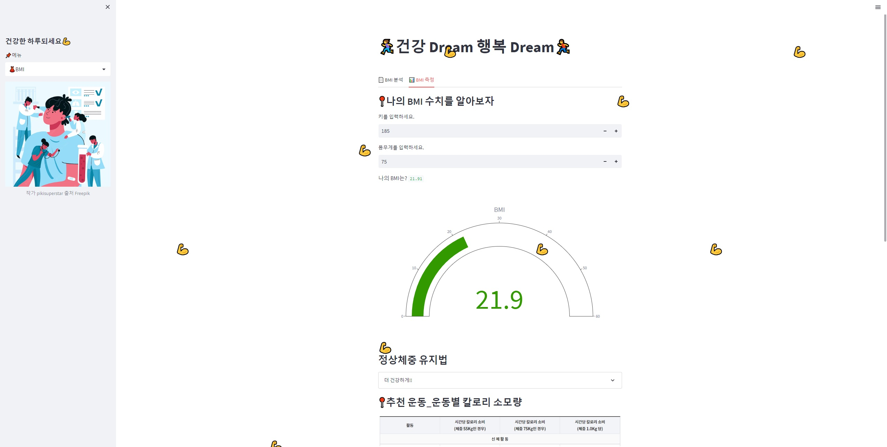

# 🏃‍♀️건강 Dream 행복 Dream🏃‍♂️
40대 이상의 건강검진정보를 통해 BMI(체질량지수)를 구해보고, 유저의 키, 몸무게를 입력하면 BMI를 구해주고 건강한 삶을 유지하는 법!을 알려줍니다.

## 📖 Contents
🏃‍♀️건강 Dream 행복 Dream🏃‍♂️   
🌈 배경  
🖥️ 기술스택  
📑 배포 주소 및 스크린샷  
📈 프로젝트 설명 
📍 오류해결
🙏 마무리

## 🌈 배경
*오래오래 무병장수하려면?*
과거보다 현재 비만으로 인한 유병률이 크게 증가하고 있는 추세입니다.  
건강검진 정보에 몸무게와 키는 나와있지만 BMI(체질량지수)는 빠져있어, BMI를 구하였습니다.  
유저의 키와 몸무게를 입력받아 BMI를 구하고 건강한 삶을 유지하기 위해 필요한 운동법, 식습관에 대한 조언을 받을 수 있습니다.

## 🖥️ 기술스택
### 사용한 언어 
  

### 사용한 라이브러리  
 

### 사용한 툴  
       

## 📑 배포주소 및 스크린샷
### 배포주소
http://ec2-3-34-131-142.ap-northeast-2.compute.amazonaws.com:8501/
### 스크린샷
  

## 📈 프로젝트 설명
- 데이터는 2020년 건강검진정보입니다.
  - 공공데이터포털(https://www.data.go.kr/data/15007122/fileData.do)  

- 컬럼 소개
1. 기존 컬럼
  - 성별코드 : 0(여자), 1(남자)
  - 연령대코드(10세단위) : 0(40대), 1(50대), 2(60대), 3(70대), 4(80대 이상)
  - 신장(5Cm단위) : ex. 100~104CM -> 100CM
  - 체중(5Kg 단위) : ex. 25~29KG -> 25KG
  - 허리둘레 : 검진자의 허리둘레
  - 음주여부 : 0(마시지 않는다), 1(마신다)
  - 흡연상태 : 0(피우지 않는다), 1(이전에 피웠으나 끊었다), 2(현재도 피우고 있다)
  - 식전혈당(공복혈당) : 식사 전 혈당(혈액 100ml당 함유 되어 있는 포도당의 농도) 수치
  - 수축기혈압 : 최고 혈압으로 심장이 수축해서 강한 힘으로 혈액을 동맥에 보낼 때의 혈관 내압
2. 만든 컬럼
  - BMI : 체질량지수, 몸무게(kg) / 키(m) / 키(m)
  - BMI_bins : 0(18.5 미만 : 저체중), 1(18.5~24.9 : 정상체중),
               2(24.9~29.9 : 과체중), 3(29.9 이상 : 비만)  
  
- 기존 컬럼 중 신장과 체중으로 체질량 지수를 구하고, 체질량지수의 범위를 수치화했습니다. 
  - BMI 구하는 법 : 몸무게(Kg) / 키(M) / 키(M)
  - BMI 구간 : 저체중(18.5 미만), 정상체중(18.5~24.9), 과체중(25~29.9), 비만(30 이상)

- 컬럼별 최소/최대 데이터를 구해 각 컬럼의 특징을 알아보았습니다.

- BMI 구간의 분포를 파이 그래프를 통하여 시각화하였습니다.

- BMI의 히트맵을 그려 BMI는 어떤 건강정보와 관련이 있을지 상관분석하였습니다.

- 유저의 BMI를 input 받아 유저의 BMI의 구간을 알려주고, 운동법과 식습관을 추천해줍니다.

## 📍 오류해결
- 오류
  - 데이터가 많아(약 10만건) 파일의 용량이 커 EC@ 프리티어 서버가 꺼지는 에러 발생!
- 해결
  - EC2 프리티어에 모두 담을 수 없어 데이터 전처리를 진행하고 정리한 데이터를 저장해 사용하였습니다.
    - 10만 건의 데이터를 랜덤으로 1만 건 추출하여 진행하였습니다.
  - 또한 Linux에서 swap 메모리를 설정하여 실제 메모리 Ram이 가득 찼지만 더 많은 메모리가 필요할때 디스크 공간을 이용하여 부족한 메모리를 대체할 수 있는 공간을 설정하였습니다.
    - 참고사이트(번데기 개발자의 메모장 https://jw910911.tistory.com/122)

## 🙏 마무리
- 40대 이상 연령대 사람들의 BMI는 허리둘레와 체중과 관련이 있습니다.
- 음주와 관련이 클 것 같지만 관련성이 적었습니다.
- 40대 이상 연령대 사람들 중 40.8%가 과제충, 비만인 것으로 나타났습니다.
- 자신의 BMI를 알고 운동법과 식습관을 조언받아 건강한 삶을 유지하기 위해 노력합시다.